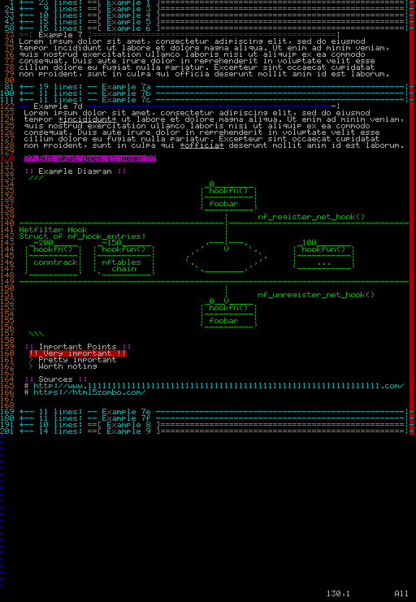
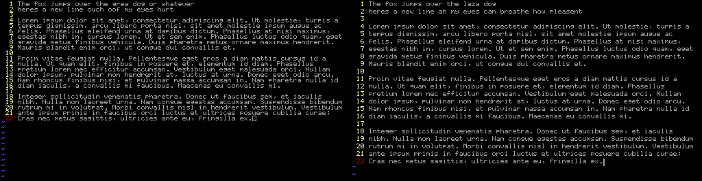
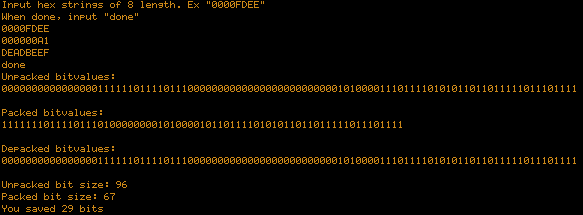
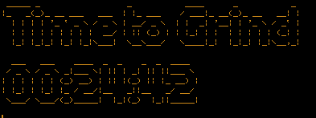

A collection of miscellaneous things that aren't big enough for their own repository, such as small scripts, fonts, or dotfiles.

# vim-notes-syntax
Adds color for your plaintext notes. 
Helpful for organizing information.
No plugins required!

## iPortfolio
Modified version of Mx437_Portfolio_6x8.ttf taken from OldSchool PC Fonts https://int10h.org/oldschool-pc-fonts/fontlist/font?portfolio_6x8

I enjoyed this font for a long time as it lets me have 160 columns in my terminal on my 1024x768 screen, but after not much time my eyes would begin to strain due to how close the lines were together. I added some more space inbetween the lines with FontCreator 11 and now share here.

Here is an image to compare, the original font is on the left, and my version is on the right.

## Golang Bitpacker
A pseudo-bitpacker written in go, part of my studies in compression and understanding the different methods employed.

## Simple Pomodoro Timer
Pomodor timer written in bash that I use to pace my studies.

